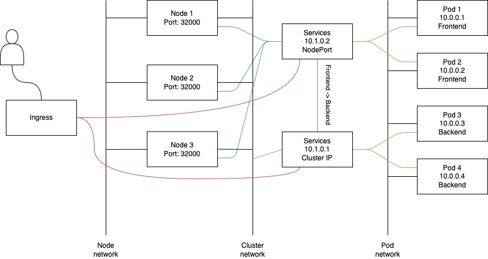

# Kubernetes

## Prerequisites

Kubernetes is a container orchestration system.

Kubernetes supports the following container runtimes:

- Docker
- CRI-OI
- containerd

Kubernetes are also known as K8S, or k8s (there are 8 characters between k and s in kubernetes)

## Introduction

### Basics

K8s can be used for the following actions:

- Automatic deployment
- Load Distribution
- Auto-scaling
- Monitorinc and health Check
- Replacement of failed containers

Anatomy of k8s:

- Cluster
  - Node (baremetal or virutal server)
    - Pod
      - Container

**Multiple nodes will not automatically form a cluster. You need to group them manually.**

Usually there is a *master node* and multiple *worker nodes*.

The master node runs only system pods, the deployment takes place only in worker nodes.

Each node contains multiple services:

- kubelet
- kube-proxy
- Container Runtime (Docker, CRI-O, containerd)

The master node also contains:

- **API Server** service which makes communications between the nodes possible
- **Scheduler** is responsible for load distribution
- **Kube Controller Manager** controlls what happends on each node of the cluster
- **Cloud Controller Manager** interacts with cloud service providers
- **etcd** stores all logs of the operation of k8s cluster (key-value pairs format)
- **DNS** service to connect deployments by names

The command line tool to connect to a cluster is `kubectl`.

### Dependencies and Installation

To run k8s locally you need to to use **microk8s** which is a *powerful, lightweight, reliable production-ready Kubernetes distribution* made by Canonical. The setup procedure is simple, just follow [these steps](https://microk8s.io/#install-microk8s).

**For this guide we use an alias `k="microk8s kubectl"` to make it easier to type.**

## Basic commands

|Command|Action|
|---|---|
|`k run nginx-abc-xyz --image=nginx`|Run an Nginx pod named *nginx-abc-xyz*|
|`k exec nginx-deployment-abc-xyz -- nslookup google.com`|Execute `nslookup google.com` command inside container. You can also pass `-it` argument to make it interactive just like in Docker|
|`k describe pod nginx-abc-xyz`|Get more info about *nginx-abc-xyz* pod created earlier|
|`k get pods`|List the pods. Append `-o wide` to get more info or `-o yaml` to get the yaml data. **Please specify the name of the pod and pipe it through `less` if you use `-o`, otherwise it will print a lot of data.**|
|`k get pods --namespace=kube-system`|List pods that are running in *kube-system* namespace|
|`k explain pods.spec.enableServiceLinks`|Get the documentation of a specific field of a resource. You can also use `k explain pods` only to get the documentation of the resource and its fields|
|`k cluster-info`|List the cluster informations|
|`k get nodes`|List the nodes. If you use *microk8s* it will list only one|
|`k get namespaces`|Will list the namespaces. Also works with `k get ns`|
|`k get all --all-namespaces`|List all resources for all namespaces|
|`k delete pod nginx-abc-xyz`|Delete *nginx-abc-xyz* pod|

Just to clarify, ***namespaces** are a way to organize clusters into virtual sub-clusters, they can be helpful when different teams or projects share a Kubernetes cluster. Any number of namespaces are supported within a cluster, each logically separated from others but with the ability to communicate with each other.*

## Pods

**Pod** is the smallest unit in the k8s world. Containers are created inside the pod. A pod can run multiple containers withn a single namespace, exposed by a single IP address. Kubernetes doesn't manage containers directly, it manages containers through pods.

Although the standard is one container in a pod, multiple containers in a pod are used in specific cases such as logging and monitoring.

There is also the posibility to run *naked* pods, they are the pods that you can create directly through a definition file. Try to avoid these ones, they have many disadvantages (cannot be scaled, cannot be replaced automatically, etc.)

A pod contains:

- Containers
- Shared Volumes
- Shared IP Address

### Pod Troubleshooting

#### Check errors

You can use `k describe pod my-pod` command (as seen in the [Basic commands](#basic-commands) section) to check why the pod is not starting or if it has an error. This will tell you the reason and exit code of the error

You can dig deeper with `k logs podname` command to figure out what is going wrong when an application generates a non-zero exit code.

#### Test pod accessibility

You can use `k port-forwarding my-nginx-pod 8080:80 &` to test the accessibility of the pod. You can then run `curl localhost:8080` to check the results.

**Use this for testing only, do not use this to expose ports, for networking check [Networking Section](#networking)**

### Pod SecurityContext

A **SecurityContext** defines privilege and access control settings for a Pod or container. Use `k explain pod.spec.securityContext` or `k explain pod.spec.containers.securityContext` for further details.

## Jobs

Pods are normally created to run forever. If you want to create a pod that performs a task and then stops, use a *Job* instead (Tasks like: backup, calculation, batch processing, etc.). You can also use `spec.ttlSecondsAfterFinished` to clean up completed *Jobs* automatically ebcause you don't want to keep those *completed Jobs* and *completed pods* forever.

There are three different Job types:

|Name|Description|Configuration|
|---|---|---|
|Non-parallel Jobs (default)|One pod is started, unless the pod fails|- `completions=1` <br> - `parallelism=1`|
|Parallel Jobs with a fixed completion count|The Job is complete after successfully running as many times as specified in `jobs.spec.completions`|- `completions=x` <br> - `parallelism=y`|
|Parallel Jobs with a work queue|Multiple Jobs are started, when one completes successfully, the Jobs is complete. Frequently, the `parallelism` is set equal to the number of nodes on which you want this job to run|- `completions=1` <br> - `parallelism=x`|

You can also use a **CronJob* to schedule a Job. It works just like a `cron` job works in Linux. Check the syntax by running `k create cronjob -h`.

## GUI/Web interface

Kubernetes dashboard provides a web interface to manage kubernetes.

In microk8s it is quite easy to deploy, just use `microk8s enable dashboard`.

For other environments it might be more difficult because you need to secure access to the dashboard.

**Do not use dashboard on the public internet!**

## Resource limitations and quota

By default, the pod wont't have any resource limitations in terms of CPU and memory to perform the tasks.

This can be managed by using Memory/CPU requests and limits in `pod.spec.containers.resources`. A request is an initial request for resources, think of it as the minimum required amount of resources. A limit defines the upper treshold.

CPU limits are expressed in milicore ore milicpu, 1/1000 of a CPU core: `500 milicore = 0.5 CPU`

When using a deployment, use `k set resources` to change resource limitations on running applications with zero downtime. This doesn't work on pods, they don't provide an update mechanism.

You can also use resource limitations in combination with quota on namespaces to restrict these applications in specific namespaces only.

## Deployments

Deployments is the standard for running applications in K8s.

In case of deployments, pods are managed entities, you cannot manage pods independently if they are inside a deployment.

The deployment is helped by the replica set. The replica set takes care of the replication and if the desired number is not fulfilled it will start pods automatically to meet the requirements.

### Create deployments

The most common way to create multiple pods, for scaling purposes, is by using deployments.

To create an *nginx* deployment:

```bash
# Create deployment
k create deployment nginx-deployment --image=nginx

# Get info about deployment
k get deployments

# Get info about the pods
k get pods

# Get the details about the deployment
k describe deployment nginx-deployment
```

In this casem the pods are managed by the deployment.

### Scale the deployment

Scale out (up):

```bash
# Scale the deployment
k scale deployment nginx-deployment --replicas=5

# This will return 5 pods
k get pods
```

Scale in (down):

```bash
# To scale in, just change the replicas number
k scale deployment nginx-deployment --replicas=3

# This willr eturn 3 pods
k get pods
```

#### AutoScaling

In real clusters, Pods are often automatically scaled based on resource usage properties that are collected by the *Metrics Server*.

In microk8s you can enable the Metrics Server with `microk8s enable metrics-server` command.

The command that handles autoscaling works like this `k autoscale deployment my-nginx-deployment --cpu-percent=50 --min=1 --max=10`

For more details run `k autoscale -h`.

### Port mapping

Pods get their IPs dinamically, and those IP addresses are accessible only from inside the node.

To connect to specific deployments using specific IP addresses you need to create services and there are different options available:

- Create cluster IP (it will be assigned to a specific deployment)
- Create external IP address by:
  - Expose the deployment to the IP address of the node
  - Use a load balancer (**most common solution**)

For more details check [Networking section](#networking)

#### Create service to expose a specific port with a *cluster IP*

This is usually used to allow services to talk to eachother inside a cluster.

```bash
# Expose internal port 80 of the container to external port 8080
k expose deployment nginx-deployment --port=8080 --target-port=80

# List the services. This will list the cluster IP and port that will be available only inside the cluster
k get services

# Get more details about the service
k describe service nginx-deployment
```

#### Create service to expose a specific port with a *NodePort*

This will map the port from the pod to the node IP, thus, making it accessible through the node address.

This option wil bind the desired pod port to a random port on the node.

```bash
k expose deployment nginx-deployment --type=NodePort --port=80
```

#### Create service to expose a specific port with *LoadBalancer*

This creates a service and uses the load balancer type to expose the port.

```bash
k expose deployment nginx-deployment --type=LoadBalancer --port=80
```

### Update deployment

By default, the strategy type is *RollingUpdate*. This means that **new pods will be created with the updated image while the current pods are still running**. A new ReplicaSet will be created while the old one is still active. This is done one pod at a time to ensure that there is no downtime.

By default, the `deployment.spec.revisionHistoryLimit` is set to keep the last 10 ReplicaSets.

Set an image for a particular deployment:

```bash
# Set a new image for nginx-deployment deployment for nginx-deployment pods
k set image deployment nginx-deployment nginx-deployment=nginx/nginx:2.0
```

Always run the following command. This will return status messages related to the update:

```bash
k rollout status deployment nginx-deployment
```

### Rollback

Well, sometimes things won't go as planned and you need to undo the update.

You can do this two ways. You can either use a replica set and rollback to the previous revision:

```bash
# Inspect the history of the deployment
k rollout history nginx-deployment

# Apply the rollback
k rollout undo nginx-deployment --to-revision=<x>
```

Or you can use an older image and just "update" it to the previous version of the image:

```bash
k set image deployment nginx-deployment nginx-deployment=nginx/nginx
```

### Clean-up

Delete pods, deployment, and service:

```bash
# Delete pod
k delete pod nginx-sfhskdjhfk-dsds

# Delete deployment
k delete deployment nginx-deployment

# Delete service
k delete service nginx-deployment
```

## Create services, pods, and deployments using YAML

### YAML Manifest file

Kubernetes documentation will help you build more complex configuration files.

A YAML Manifest file has the following structure:

- apiVersion: specifies which version of the API to use for this object
- kind: indicates the type of object (Deployment, Pod, Service, etc.)
- metadata: contains administrative information about the object
- spec: contains the specifics for the object

The *containers spec* requires different parts:

- name: name of container
- image: image used
- command: the command the container should run
- args: arguments that are used by the command
- env: environment variables that should be used by the container

**Use `kubectl explain` to get more information about the basic properties to build the YAML file.**

```bash
# Get info about pod properties
k explain pod

# Go deeper into the pod properties
k explain pod.spec

# Even more data
k explain --recursive pod.spec
```

### Basic YAML configuration

In Visual Studio Code, the Kubernetes extension will help you create a deployment. Just type `deployment`, `pod`, or `service` and click on the suggestion. A template file will be generated automatically. Change it accordingly:

```yaml
apiVersion: v1
kind: Pod
metadata:
  name: mypods
  namespace: default
spec:
  containers:
  - name: busybox
    image: busybox
    command:
      - sleep
      - "3600"
  - name: nginx
    image: nginx
```

Apply the YAML file:

```bash
# You can also use create instead of apply but if the resource already exists, it will return an error
k apply -f mypods.yaml
```

You can also use a single file and separate the *service*, *deployment*, and *pod* configuration using `---`

To delete deployments you can run `k delete -f mypods.yaml`.

### Generate config files

**It is considered a best practice to generate YAML files and not create them form scratch.** You can generate YAML files by using `--dry-run=client -o yaml > my.yaml` as an argument to `kubectl run` and `kubectl create` commands:

```bash
kubectl run mynginx --image=nginx --dry-run=client -o yaml > mynginx.yaml
```

### INIT containers

An init container is an additional container in a pod that completes a task before the main container is started. The main container will only be started once the init container has been started.

You can use `initContainers` argument in the YAML configuration file to declare the init container, the rest of the arguments underneath it are standard arguments for one or more containers.

## Namespaces

A Linux NameSpace implements kernel-level resource isolation. Kubernetes offers NameSpace resources that provide the same functionality. Different Namespaces can be used to strictly separate between customer resources.

You can tjink of namespaces as directories used to organise different applications and make sure that components for a specific application are found in the same namespace.

Kubernetes also uses namespaces as a security features such as:

- Role-Based Access Control (RBAC)
- Quota

You can manage a namespace by running:

```bash
# Create namespace
k create namespace mynamespace

# Work in a specific namespace
k <commands> -n mynamespace

# Delete a namespace
k delete namespace mynamespace

# Get configuration data of namespace such as quota and limits
k describe namespace mynamespace 
```

You can also use `ns` instead of `namespace` in the command to make it quicker to type.

## Networking

### Network types

In Kubernetes, networking is all about the Pods. We have three types of networks:

- Pod network: Internal
- Cluster Network: Internal
- Node Network: External

Pods are connected only to the pod network while Nodes are connected to the Cluster network and Node network.

When a users are using your application, they are connecting to the Node Netowrk.



### Services

In Kubernetes a service has a different meaning when compared to Linux services:

- Linux Service (systemd) is the equivalent of a K8s Pod
- K8s Service is used to expose your application in a network

Service types:

- **ClusterIP**: is the default Kubernetes service for internal communications. However, external traffic can access the default Kubernetes ClusterIP service through a proxy. This can be useful for debugging services or displaying internal dashboards. **Services are reachable by pods/services in the Cluster.**
- **NodePort**: opens ports on the nodes or virtual machines, and traffic is forwarded from the ports to the service. It is most often used for services that don’t always have to be available, such as demo applications. **Services are reachable by clients on the same LAN/clients who can ping the K8s Host Nodes.**
- **LoadBalancer**: is the standard way to connect a service externally to the internet. In this scenario, a network load balancer forwards all external traffic to a service. Each service gets its own IP address. **Services are reachable by everyone connected to the internet.**
- **Ingress**: acts as a router or controller to route traffic to services via a load balancer. It is useful if you want to use the same IP address to expose multiple services.

### Connect different deployments together

It is very common to connect multiple deployments together. Such as a web interface application to a database.

The web interface usually has a *LoadBalancer* or *NodePort* type and the database has a *ClusterIP* type.

The User will connect to the frontend via *NodePort* or *LoadBalancer* and the frontend will communicate with the backend via *ClusterIP*.

### Ingress Controller

An Ingress Controller is basically a Load Balancer. The outside users will interact with your application through this load balancer which forwards the connection to the cluster nodes.

The ingress controller also has an API component. Once the user reaches the ingress controller, an API call will be used to connect to the services inside the cluster.

Ingress controllers are provided by the community (HAProxy, NGINX, Traefik, etc.).

## Storage

In Kubernetes, the Pod storage maps the storage defined at the container level to any type of storage (local or cloud).

You can use a Pod Volume or PVC (Persistent Volume Claim).

Pod Volumes are used to allocate storage that outlives a container and stays available during Pod lifetime and it can be directly bound to a specific storage type (e.g. storage on the node like you bind storage on the Docker host).

With PVC, you request a bind access to a persistent volume. If there is not an exact match of specifications, the PVC will request a Storage Class which will create the Persistent Volume on demand according to your needs.

### Volume Types

There are multiple types of Pod Volumes (`pod.spec.volumes`):

- `emptyDir`: Temporary directory that will be created on the host
- `hostPath`: Persistent directory that will be mapped to an existing directory on the host

To mount these volumes you need to configure `pod.spec.containers.volumeMounts`.

For more volume types check `k explain pod.spec.volumes`.

## ConfigMaps

### Create ConfigMaps

It's best practice to separate site-specific information from code.

Kubernetes provides *ConfigMaps* to deal with this issue.

A ConfigMap is being used to define the variables and the Deployment will point to the ConfigMap.

You can use ConfigMaps for the following purposes:

- Pass variables
- Provide configuration files
- Pass command line arguments

**The ConfigMap should exist in the cluster before running the application.**

You can create a ConfigMap with `k create cm` and you can pass variables and config files like this:

- `k create cm --from-env-file=my_var_file`
- `k create cm --from-literal=MYSQL_USER=my_db_user`
- `k create cm myConfigMap --from-file=/path/to/file.conf`

**You can only use one `--from-env-file` but multiple `--form-literal`.**

**The configuration file will be treated as a volume so you will need to mount it in order to use it with ConfigMap inside the Pod.**

To use the ConfigMap in your Deployment run `k set env --from=configmap/myConfigMap deploy/my_app`.

You can also use the `--dru-run=client` and the redirect operator on `k create deploy` and `k set env` commands to generate the ConfigMap YAML configuration file.

### Secrets

There are three types of secrets that you can use:

- `docker-registry`: Used for authenticating in a private registry
- `TLS`: Used to store TLS keys
- `generic`: Creates a secret from a local file, firectory, or literal value

Secrets are not encrypted they are only `base64` encoded.

All Kubernetes resources need to access TLS keys. These keys are provided by Secrets and used through ServiceAccounts.

A ServiceAccount acts like a user that comes with credentials that allows a Pod to fetch the required informations from the Kubernetes cluster.

Every single pod has its own ServiceAccount.

RBAC is used to connect a ServiceAccount to a specific Role.

Example of `coredns` secrets:

```bash
# The coredns Pod has a secret named coredns-token-blabla
k get sa -n kube-system coredns -o yaml | less

# To view that secret (a certificate file, namespace and a token)
k get secret -n kube-system coredns-token-blabla -o yaml | less
```

You can decode the base64 values with `echo "my_value" | base64 -d`.

Example of how to provide secrets to an application:

```bash
# TLS Keys
k create secret tls my_tls_key --cert=tls/my_cert.crt --key=tls/my_key.key

# Passwords
k create secret generic my_password --from-literal=password=pa5sw0rd

# Files
k create secret generic my_ssh_key --from-file=ssh-private-key=.ssh/id_rsa

# Docker Registry
k create secret docker-registry my_docker-creds --docker-username=john --docker-password-myP@ss --docker-email=john@doe.com --docker-server=my.registry:5000
```

**A Secret is basically an encoded ConfigMap.**

If the secret contains variables use `k set env`. If it contains files, mount the Secret.

**While mounting the Secret in the Pod spec, it is best practice to use `defualtMode` to set the permissions to `0400`.**

## Helm

Helm is used to streamline installing and managing Kubernetes applications. It consists of the helm tool, and a chart which is the package itself that contains:

- A description of the package
- Templates containing K8s manifest files

Helm charts can be stored locally or can be accessed from Helm repositories.

Install Helm like this:

```bash
# Get the archive from https://github.com/helm/helm/releases
tar xzvf gelm-xxx.tar.gz
sydo mv linux-amd64/helm /usr/local/bin
helm version
```

Or install Helm for microk8s by running `microk8s enable helm` or `microk8s enable helm3`.

The main repository for Helm charts is [artifacthub.io](https://artifacthub.io). You will find instructions for each package. Another popular repository is Bitnami.

Basic Helm commands:

- `helm repo update`: update repositories
- `helm pull`: fetch a local copy of the helm chart as an archive (you can edit this manually and I consider it a best practice to avoid default values)
- `helm install`: install package from remote repository
- `helm instal -f local-chart.yaml`: install package from local file
- `helm list`: list currently installed charts
- `helm delete`: remove installed charts

One way to check what default values a helm chart for NGINX from Bitnami repository is using is to run `helm show values bitnami/nginx`. Pull the chart, extract the archive then edit `values.yaml` file.

To check the values that will be used run `helm template --debug <chart-directory-name>`.

## Kustomization

Kustomization is the equivalent of Docker Compose for K8s.

A sample file looks like this:

```yaml
# Defines which resources (YAML files) will be applied
resources:
  - deployment.yaml
  - service.yaml
# Defines a prefix that will be added to all names
namePrefix: my_prefix-
# Defines the namespace
namespace: my_namespace
# Labels that will be applied to all objects
commonLabels:
  environment: my_environment
```

To apply the configuration run `k apply -k .`. To delete the configuration run `k delete -k .`

For more details check the Kubernetes Documentation.

## Kubernetes Troubleshooting

### Standard Strategy

This is the flow of actions when you start a Pod **`k run ...` &rarr; api-server &rarr; etcd &rarr; scheduler &rarr; kubelet &rarr; run container**.

No matter what you are going to do, your resources will end up added in `etcd` so the best tools to help you are `k describe` and `k logs podname`commands.

### Cluster Event Logs

`k get events` or `k get events -o wide` will provide an overview of cluster events.

### Authentication Problems

Access to the cluster is provided by `~/.kube/config` file. This file is copied from the control node in the cluster located at `/etc/kubernetes/admin.conf`

Use `k config view` to check contents of this file

For additional authorisation based issues, as an example, run `k auth can-i create pod`.

### Probes

Probes can be used to test access to Pods. a *readinessProbe* is uesed to make sure a Pod is not published as available unless the *readinessProbe* has been able to access it.

The *livenessProbe* is uesed to continuously check the availability of a Pod.

The *startupProbe* is used for legacy applications that require additional startup time on firt initialisation.

The probe is actually a simple command. The following probe types are defined in `pods.container.spec`:

- `exec`: a command is executed and returns a zero exit value
- `httpGet`: an HTTP request returns a response code between 200 and 399
- `tcpSocket`: connectivity to a TCP socket (available port) is successful

## Change container runtime from Docker to CRI-O

To change the container runtime you need to change the microk8s configuration in `/var/snap/microk8s/current/args/kubelet`. There, you need to change `--container-runtime=containerd`. Then run `microk8s stop && microk8s start`. To install run: `helm install -f nginx/values.yaml my-nginx nginx/`.

## Sources

- [FreeCodeCamp YouTube Channel](https://youtu.be/d6WC5n9G_sM)
- [VMWare Glossary](https://www.vmware.com/topics/glossary/content/kubernetes-networking.html#:~:text=Kubernetes%20networking%20allows%20Kubernetes%20components,host%20ports%20to%20container%20ports.)
